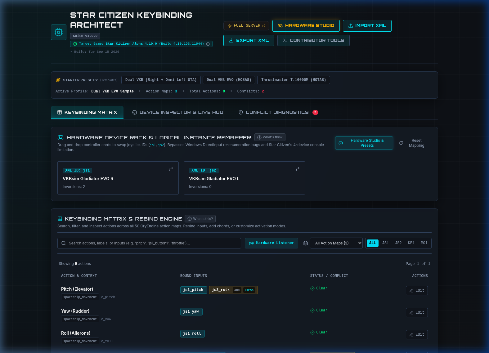
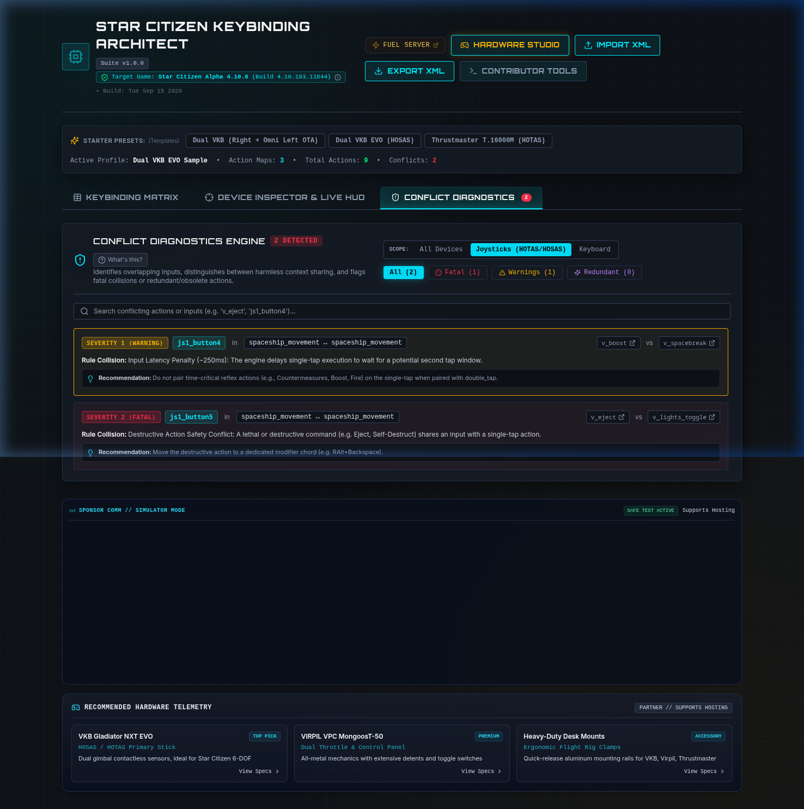
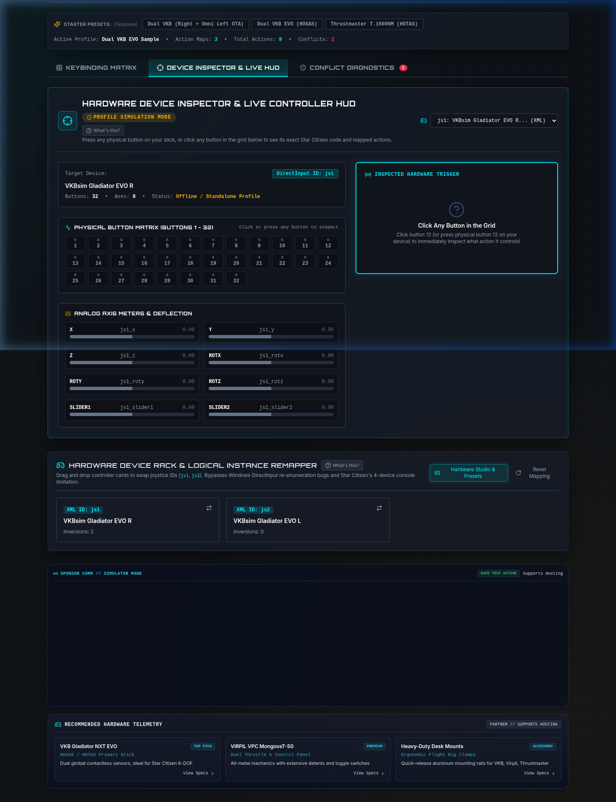
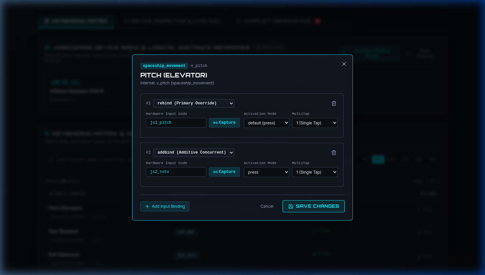

# Star Citizen Keybinding Architect

[](https://github.com/thenom/sc-controller-mapper/actions/workflows/ci.yml)

[](LICENSE)
[](https://ko-fi.com/thenom)

A high-performance visual keybinding management suite, conflict diagnostics engine, and device re-indexer engineered specifically for Star Citizen's CryEngine-derived XML input architecture.



> [!WARNING]
> **Pilot Advisory & Backup Disclaimer:** Always retain offline backup copies of your original and working keybinding XML files (`LIVE/USER/Client/0/Controls/Mappings/`) before editing, re-indexing, or importing profiles. This suite is provided as-is under the AGPL-3.0 license; the maintainers assume no responsibility or liability for any lost, altered, or overwritten mapping files.

---

## Why Pilots Need This Suite

Configuring complex HOTAS, HOSAS, pedals, and button boxes in Star Citizen's native interface has long suffered from critical engine limitations:

- **Bypasses the In-Game 4-Device Limitation**: Star Citizen's console command `pp_resortdevices` breaks whenever more than 4 input devices are connected. When Windows re-orders your USB controller IDs on reboot, your bindings break. Keybinding Architect allows you to drag-and-drop controller cards to re-order devices and rewrites `jsX_` prefixes across the entire XML AST in seconds.
- **Intelligent 4-Tier Conflict Diagnostics**: Differentiates harmless overlaps in mutually exclusive flight/ground modes from lethal collisions. Analyzes temporal mechanics (`multiTap`, `press`, `hold`, Master Modes SCM/NAV) and warns you before accidental inputs trigger fatal actions like Self-Destruct, Eject, or Jettison Cargo.
- **Live Hardware Listening Mode**: Powered by the HTML5 Gamepad API. Press any physical button or deflect any analog stick or pedal on your desk, and the UI immediately detects the input and filters to the corresponding binding.
- **Lossless CryEngine XML Round-Tripping**: Never discards device `<options>` blocks (axis inversions, sensitivity curves, product GUIDs) and preserves concurrent secondary `<addbind>` inputs alongside primary `<rebind>` overrides.

---

## Feature Showcase

### 1. Visual Hardware Device Rack & Re-Indexing
Re-order your physical flight sticks with intuitive drag-and-drop. Easily swap Joystick 1 and Joystick 2 or assign secondary throttles and pedals without losing custom axis calibrations or curves.


### 2. Intelligent Conflict Diagnostics Engine
Filter and audit bindings across four severity tiers:
- **Fatal Collisions (Red)**: Direct execution collisions or lethal hold-vs-press overlaps (e.g. `v_eject` vs. `v_lights_toggle`).
- **Input Warnings (Amber)**: Latency buffer penalties (~250ms tap buffer delay caused by pairing double-tap with single-tap).
- **Subsumed Redundancies (Purple)**: Actions where one command functionally encompasses the other (e.g. `v_flightready` + `v_power_set_on`).
- **Obsolete / Deprecated**: Bindings for systems removed or superseded in modern Star Citizen builds.



### 3. Hardware Device Inspector & Live Controller HUD
DirectInput telemetry interface featuring a 32-button matrix and analog axis deflection meters for physical throttle, stick, rudder, and slider inputs. Includes an **Offline Profile Simulation Mode** for testing profiles when away from your gaming rig.



### 4. Interactive Binding Editor Modal
Fine-grained control over individual commands. Assign primary `<rebind>` overrides or additive concurrent `<addbind>` inputs, configure activation modes (`press`, `hold`, `double_tap`, `smart_toggle`), adjust `multiTap` counts, or use the hardware capture listener.



---

## Supported Flight Hardware

Keybinding Architect supports all standard DirectInput devices, with tailored presets and telemetry templates for:

- **VKB-Sim**: Gladiator NXT EVO, Gunfighter, STECS Throttle, Omni-Throttle (OTA 6-DOF)
- **VIRPIL Controls**: VPC MongoosT-50 Series, Constellation Alpha / Alpha Prime, WarBRD
- **Thrustmaster**: T.16000M FCS, TWCS Throttle, HOTAS Warthog, TFRP & TPR Rudder Pedals
- **WinWing, Honeycomb, Logitech/Saitek** (X52/X56), and custom USB button boxes

---

## Quickstart Guide

### Option 1: Run with Docker / Podman (Recommended)
```bash
# Clone the repository
git clone https://github.com/thenom/sc-controller-mapper.git
cd sc-controller-mapper

# Build and start container (listens on port 8080)
docker-compose up -d --build
# Or with Podman:
podman-compose up -d --build
```
Open [http://localhost:8080](http://localhost:8080) in your browser.

### Option 2: Run Locally with Node.js
```bash
# Install dependencies
npm install

# Start development server
npm run dev
```
Open [http://localhost:5173](http://localhost:5173) in your browser.

### Option 3: Offline / Portable
The web application operates 100% client-side in the browser. You can load sample XML profiles from `sample-data/` or import your own `actionmaps.xml` exported from Star Citizen (`LIVE/USER/Client/0/Controls/Mappings/`).

---

## Verification & Testing

Keybinding Architect is backed by an automated test suite and pre-commit security scanning:

```bash
# Run the automated Vitest test suite across all packages (<1s execution)
npm test

# Run pre-commit checks and Gitleaks secret scans
pre-commit run --all-files

# Compile TypeScript monorepo and production web bundle
npm run build
```

---

## Fuel the Server

Keybinding Architect is an open-source tool built for the Star Citizen community. If this application saved your bindings or simplified your sim-rig setup, consider contributing a coffee or quantum fuel canister to help offset load balancing and hosting costs:

[](https://ko-fi.com/thenom)

---

## Documentation & Roadmap

- **[docs/STAGED_ROLLOUT_PLAN.md](docs/STAGED_ROLLOUT_PLAN.md)**: Full staged rollout roadmap (Private Server $\rightarrow$ GCP OpenTofu with IP Whitelisting $\rightarrow$ GCP Geo-Locked Cloud Armor WAF $\rightarrow$ Scaling Monetization).
- **[docs/ARCHITECTURE_BLUEPRINT.md](docs/ARCHITECTURE_BLUEPRINT.md)**: Full 40KB technical specification, CryEngine cipher routines, and conflict decision formulas.
- **[CONTRIBUTING.md](CONTRIBUTING.md)**: Contributor onboarding, game patch extraction workflow (`sc-daemon`), PR guidelines, and code standards.
- **[daemon/README.md](daemon/README.md)**: Native Go extraction daemon CLI documentation, Zip64 streaming, and HTTP service reference.
- **[TODO.md](TODO.md)**: Backlog of upcoming features and optional integrations.
- **[AGENTS.md](AGENTS.md)**: Agent pairing guidelines, non-negotiable invariants, and AI PR disclosure policy.

---

## License

This project is licensed under the terms of the [GNU Affero General Public License v3.0 (AGPL-3.0)](LICENSE).
